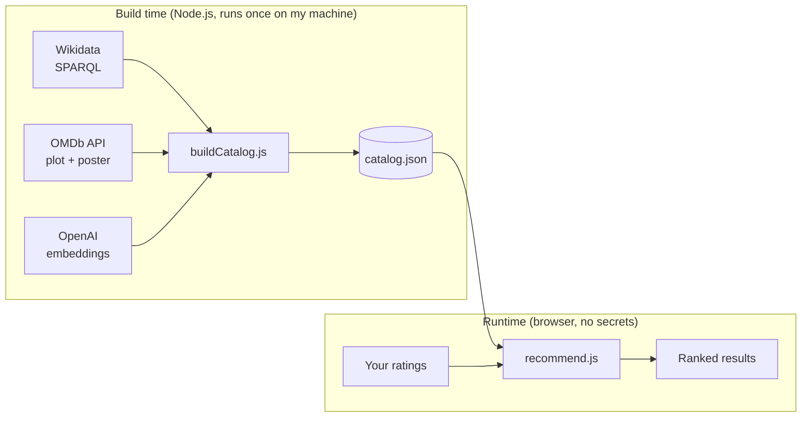

# CoCinema

**Rate a handful of movies you've seen. CoCinema finds films whose stories match your taste.**

🎬 **Live:** [cocinema-pi.vercel.app](https://cocinema-pi.vercel.app)


---

## How it works

CoCinema is a **content-based recommender**. Every movie's plot is turned into an embedding (a list of numbers where similar stories get similar numbers). Your ratings are combined into a single "taste profile", and every movie is ranked by how closely it points in the same direction.

**AI is used in exactly one place, offline.** Each plot is embedded once, at build time. Every live recommendation is deterministic maths running in your browser: no AI calls, no backend, no API keys in the client.



### The recommendation maths

1. **Mean-centre your ratings.** Each rating becomes a weight: how far it sits above or below *your own* average. A 7 from a harsh rater counts as a like; a 7 from someone who rates everything 9 counts as a dislike.
2. **Build a taste profile.** Multiply each rated movie's embedding by its weight and add them up. Movies you loved pull the profile toward them; movies you disliked push it away.
3. **Rank by cosine similarity.** Compare the profile to every unrated movie. Cosine similarity measures the *angle* between two vectors, so it captures what a story is about regardless of plot length.

### The data pipeline

- **Discovery:** the most popular films per genre from Wikidata, ranked by how many Wikipedia language editions cover them (sitelinks). A subquery sorts and limits *before* fetching labels, so each genre query stays fast.
- **Enrichment:** plot and poster from OMDb. A title-match guard rejects wrong matches (e.g. a "Making of…" featurette returned instead of the film).
- **Embeddings:** OpenAI `text-embedding-3-small`, reduced to 512 dimensions and rounded to 4 decimals. That's about 5 KB per movie instead of 30 KB, with no visible change in rankings.
- **Resilience:** the build is resumable. It reuses already-enriched movies, saves progress every 25, and stops cleanly at OMDb's daily limit so the next run picks up where it left off.

Current catalog: **576 movies** across 20 genres.

### Catalog schema

Each entry in `data/catalog.json`:

| Field | Type | Source |
| --- | --- | --- |
| `id` | string (Wikidata entity URL) | Wikidata |
| `title` | string | OMDb |
| `plot` | string | OMDb |
| `poster` | string or null | OMDb |
| `embedding` | number[512] | OpenAI |
| `rottenTomatoes` | string (e.g. `"87%"`) or null | OMDb |
| `runtime` | string (e.g. `"142 min"`) or null | OMDb |
| `director` | string or null | OMDb |
| `rated` | string (e.g. `"R"`) or null | OMDb |
| `genres` | string[] (from the 20 tracked genres) | Wikidata |
| `sitelinks` | number (Wikipedia language editions) | Wikidata |
| `year` | number (earliest release year) | Wikidata |

`rottenTomatoes`, `runtime`, `director` and `rated` are added by `node scripts/backfill.js`, which is resumable and skips entries it has already filled. `genres`, `sitelinks` and `year` are added by `scripts/fetchMeta.js` and `scripts/mergeMeta.js`.

### Data verification

Every catalog entry is checked against OMDb by title and year. A record is accepted only if the normalized title matches and OMDb's year is within one year of the Wikidata year (`data/overrides.json` lists the few exceptions). The plot stored in the catalog is then compared with OMDb's plot by shared-word overlap. Similar plots are verified; clearly different plots mean the entry holds another film's content, and `scripts/repairCatalog.js` replaces its plot, poster, metadata and embedding. Progress is kept in `data/verify-progress.json`. No IMDb ids are stored.

---

## Evaluation

Run on 7 October 2026 with `npm run evaluate` (fixed seed, no network). Mean over 20 genres and 1,000 synthetic users: precision@10 of 0.58 against a 0.16 baseline (a lift of 4.5x), the held-out liked film at the 72nd percentile on average, and found in the top 20 for 14% of users.

Method: for each genre with at least 25 films, a synthetic user is generated 50 times. They rate 6 films of that genre 9 or 10, 4 films outside it 2 or 3, and 2 other films 5 or 6, all picked at random with a fixed seed. One more film of the genre is held back. The real `recommend()` function ranks every unrated film, and the script records how much of the top 10 is in the genre, how that compares with the genre's share of the whole catalog, and where the held-back film lands.

Limitation: these are synthetic users whose taste is defined by Wikidata genre labels, and a film can carry several labels. The numbers show that the recommender picks up a genre signal from ratings. They say nothing about accuracy for real people, and results vary a lot by genre (from about 1.5x for drama to about 11x for westerns).

## Tech stack

- **Frontend:** plain JavaScript (ES modules), HTML, CSS. No framework, no build step.
- **Build scripts:** Node.js
- **Data:** Wikidata (CC0), OMDb API, OpenAI Embeddings API
- **Hosting:** Vercel (static)

## Project structure

```
scripts/            build time: runs locally, uses API keys
  wikidata.js       discover popular movies per genre (SPARQL)
  omdb.js           fetch plot + poster
  embeddings.js     plot → 512-number embedding
  buildCatalog.js   orchestrates everything → data/catalog.json
data/
  catalog.json      the only bridge between build time and runtime
  onboarding.json   hand-picked movies shown on the rating screen
src/                runtime: static files served to the browser
  main.js           screen flow and rating state
  recommend.js      taste profile + ranking
  similarity.js     dot product, magnitude, cosine similarity
  ratings.js        stores ratings
  ui.js             builds DOM elements
```

## Running locally

```bash
npm install

# Only needed to rebuild the catalog. The site itself needs no keys.
# Create a .env file in the project root:
#   OMDB_API_KEY=your_key
#   OPENAI_API_KEY=your_key
node scripts/buildCatalog.js

# Run the unit tests and the synthetic evaluation
npm test
npm run evaluate

# Serve the site
npx serve . -l tcp://127.0.0.1:3000
# then open http://127.0.0.1:3000/src/
```

## Roadmap

- Movie detail pages: description, trailer, where to watch
- Shuffled onboarding from a larger pool, so repeat visits feel fresh
- "Why this pick" explanations, decomposing each score into your ratings' contributions
- Co-watch mode: two people rate, and CoCinema finds films you'd both enjoy

## Credits

Movie data from [Wikidata](https://www.wikidata.org) (CC0) and the [OMDb API](https://www.omdbapi.com). Embeddings by [OpenAI](https://platform.openai.com).
