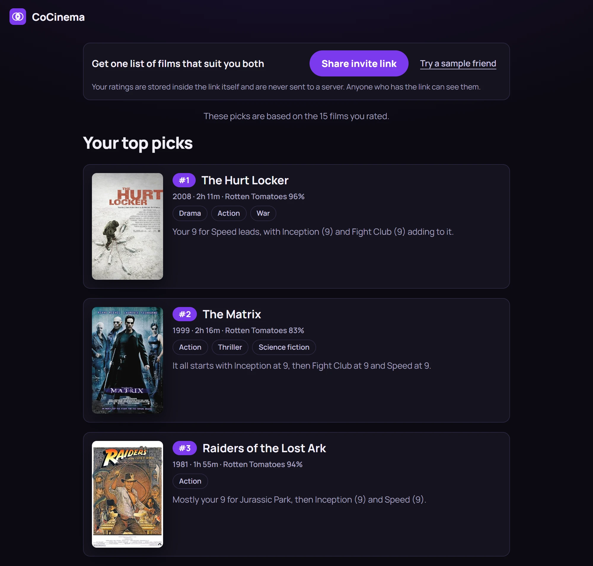
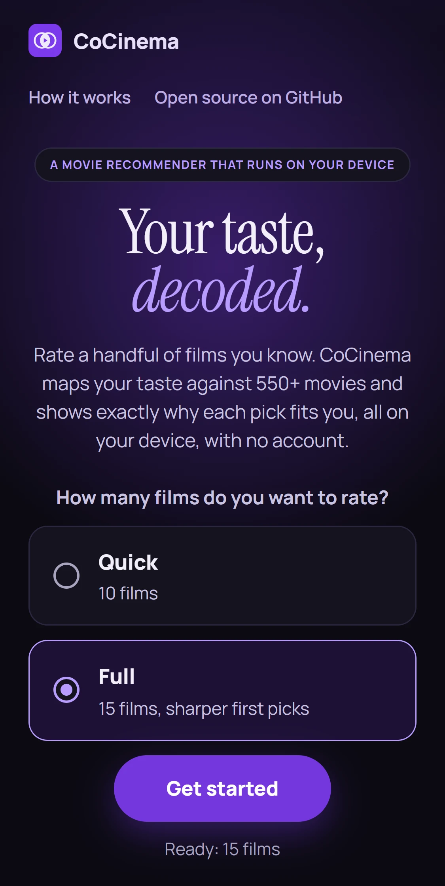
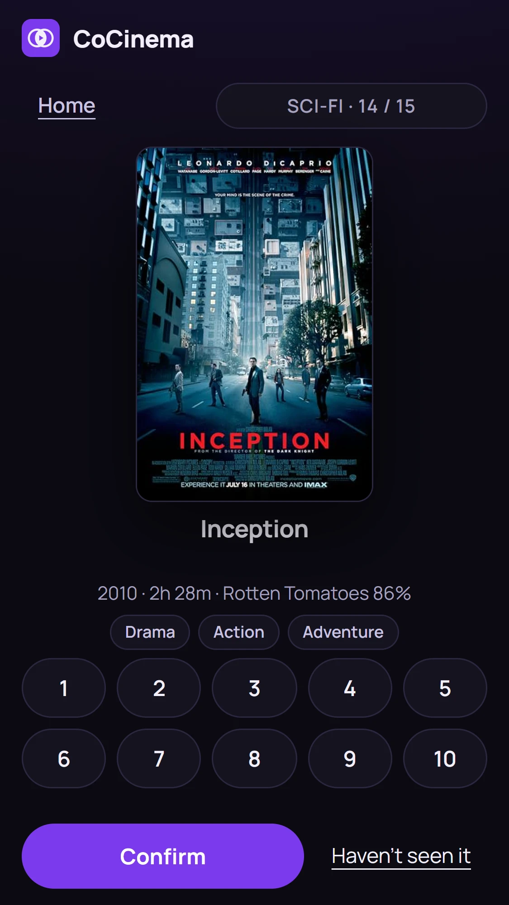
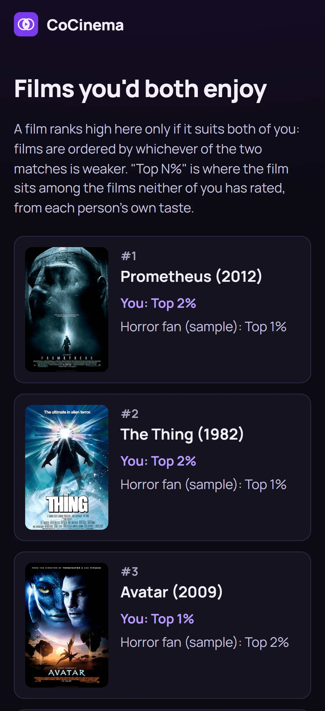
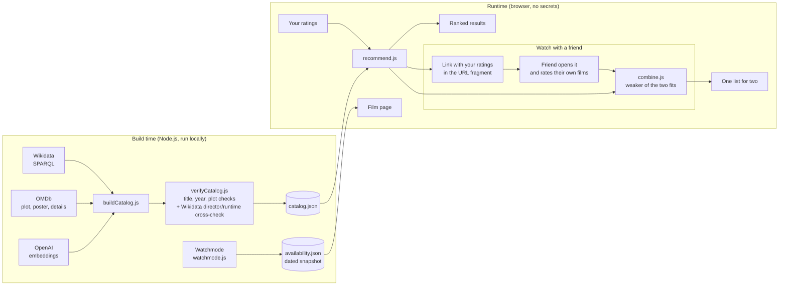

<p align="center">
  
</p>

# CoCinema

**Rate a handful of films you know. CoCinema maps your taste against 550+ movies and shows why each pick fits you, all in your browser with no account.**

🎬 **Live:** [cocinema-pi.vercel.app](https://cocinema-pi.vercel.app)



<p align="center"><em>An example run: each reason is an exact breakdown of the person's own ratings.</em></p>

<p align="center">
  
  
  
</p>

---

## What it does

- **Quick or Full onboarding.** Nothing is pre-selected. Quick asks you to rate 10 films (10 of the 15 genres, a different 10 each session); Full covers all 15 genres. Skip any film you have not seen. The order of genres and films is shuffled per session from a saved seed, so a refresh resumes on the same film. Each film is shown with its poster, year, runtime, Rotten Tomatoes score and genres next to the scores.
- **Picks with reasons.** The top 5 each carry a short line naming the films you rated that drove the pick and the score you gave them ("Your 9 for X did most of the work here, with a nudge from Y (8)."), plus, on at most two cards, the one film that held the pick back when that pull is large. The wording is chosen from the film's id, so a list always reads the same way, no two top cards open or end alike, and the held-back clause appears on at most two cards. Every card also shows its year, runtime, Rotten Tomatoes score and genres. The rest follow in a compact grid. "Rate 5 more" adds five well-known unrated films, at most two per genre, to sharpen the list.
- **Where a film sits for you.** Top picks show a rank; other films show "Top N% for your taste", its place among the films you have not rated. It ranks films against each other and is not the chance you will like one.
- **Film pages.** Poster, genres, runtime, director, age rating, Rotten Tomatoes score, the full plot, a breakdown of how each film you rated pushed this one up or down, a YouTube trailer search, and which services carry it (subscription, rent or buy) in Canada, the US and the UK, from a dated Watchmode snapshot, with JustWatch search links (searches, not a guarantee of availability).
- **Watch with a friend.** A banner at the top of the results has the invite button (it copies the link, or opens the share sheet where there is one) and a "Try a sample friend" control. Your friend rates their own films and you both get one list of films that suit the two of you. There are three made-up sample friends (horror, romance, sci-fi) to try it alone.
- **Home, Back and Start over never lose your ratings by accident.** The logo and a Home button on the rating screen go home; with at least one rating (and for the browser Back button) a dialog asks "Leave and keep your ratings?". The landing page then offers "Continue (n of N)" beside the Quick and Full choice, which still has no default. "Start over" asks before it clears anything.
- **Installable and offline.** After one visit the app works with no connection (posters excepted) and can be added to the home screen. Ratings and position are saved in the browser. The screens are checked with an automated accessibility scan (axe).

## How it works

CoCinema is a **content-based recommender**. Each film's plot is turned into an embedding (a list of numbers where similar stories get similar numbers). Your ratings are combined into one taste profile, and every film is ranked by how closely it points the same way.

**The embedding model is used in one place, offline.** Each plot is embedded once, at build time, with OpenAI `text-embedding-3-small`. Everything live is deterministic maths in your browser: no model calls, no backend, no keys in the client.



### The taste profile and cosine similarity, in plain words

1. **Mean-centre your ratings.** Each rating becomes a weight: how far it sits above or below *your own* average. A 7 from a harsh rater counts as a like; a 7 from someone who rates everything 9 counts as a dislike.
2. **Build a taste profile.** Multiply each rated film's embedding by its weight and add them up. Films you loved pull the profile toward them; films you disliked push it away.
3. **Rank by cosine similarity.** Compare the profile with every unrated film. Cosine similarity measures the *angle* between two vectors, so it captures what a story is about regardless of plot length.

### Watch with a friend: ratings in the link

Your ratings are written into the link itself, after `#/with/`, as a short encoded string (format version 1: each film's Wikidata number in base 36 plus one digit for the score, then base64-url encoded). The part after `#` is never sent to a server, so nothing is stored anywhere; anyone who has the link can read the ratings, and the app says so. A link holds at most 120 films, and bad or unknown links are handled with a plain message.

When your friend opens the link and rates their own films, each person's score for every film neither has rated is turned into a rank among those same films. A film is **only as good as its weaker fit**: films are ordered by the worse of the two ranks, then by the average of the two, then by title and id so the order is the same every time. Each person's score is the same one they would see on their own results screen. Your friend's ratings are only read for this list; they are never added to your own profile.

## Data quality and verification

- **Discovery:** the best-known films per genre from Wikidata, ranked by how many Wikipedia language editions cover them.
- **Enrichment:** plot, poster, runtime, director, age rating and Rotten Tomatoes score from OMDb. A title guard rejects wrong matches (for example a "Making of..." featurette).
- **Title, year and plot checks:** `scripts/verifyCatalog.js` checks every entry against OMDb. The normalised title must match and OMDb's year must be within one year of Wikidata's. The stored plot is then compared with OMDb's by shared-word overlap. Clearly different plots mean the entry holds another film's content, and `scripts/repairCatalog.js` replaces its plot, poster, metadata and embedding. In the progress file, 552 entries verified at the first check and 22 mismatches were repaired; a test asserts that every entry is verified or a repaired mismatch.
- **Director and runtime cross-check:** `scripts/crossCheckWikidata.js` compares each entry's director (by family name) and runtime (within 20 minutes) with what Wikidata says about the same film id, as an independent check on remakes that share a title.
- **Overrides:** `data/overrides.json` lists the few documented exceptions (for example a title OMDb spells differently, or a release year that disagrees), each with a note.
- **Tests on the data:** the catalog test suite checks that no two films share a plot, every film has a poster, plot, year and 512-number embedding, and the streaming snapshot holds exactly the films in the catalog.
- **Embeddings:** reduced to 512 dimensions and rounded to 4 decimals, about 5 KB per film instead of 30 KB.
- **Resilience:** the build is resumable and stops cleanly at OMDb's daily limit. No IMDb ids are stored.

Current catalog: **574 films** across 20 genres, from `data/catalog.json`. Posters come through OMDb and are loaded from `m.media-amazon.com`.

### Catalog schema

Each entry in `data/catalog.json`:

| Field | Type | Source |
| --- | --- | --- |
| `id` | string (Wikidata entity URL) | Wikidata |
| `title` | string | OMDb |
| `plot` | string | OMDb |
| `poster` | string or null | OMDb |
| `embedding` | number[512] | OpenAI |
| `rottenTomatoes` | string (e.g. `"87%"`) or null | OMDb |
| `runtime` | string (e.g. `"142 min"`) or null | OMDb |
| `director` | string or null | OMDb |
| `rated` | string (e.g. `"R"`) or null | OMDb |
| `genres` | string[] (from the 20 tracked genres) | Wikidata |
| `sitelinks` | number (Wikipedia language editions) | Wikidata |
| `year` | number (earliest release year) | Wikidata |

### Onboarding pools

`data/onboarding.json` holds 15 genre pools of up to 8 films. The original hand-picked films stay; `node scripts/buildOnboarding.js` tops each pool up with the best-known verified catalog films that have a poster, plot, year and embedding and a title that appears only once. Rerun it after catalog changes.

### Streaming availability

`node scripts/watchmode.js` looks up where each film can be watched in Canada, the US and the UK and writes service names to `data/availability.json`. It is resumable and stops at a credit cap (`--max-credits`, default 2000). The film page loads the file only when a film is opened; if it is missing, has no entry, or is more than 30 days old, the page shows only the JustWatch search links.

This is a snapshot, not live data. Under Watchmode's free plan the cached data must be **refreshed or deleted within 30 days** of the fetch date. The current snapshot was fetched on **7 October 2026**, so refresh or delete it by **6 November 2026**. To refresh, delete `data/availability.json` and run the script. The key goes in `.env` as `WATCHMODE_API_KEY` and is never printed or committed.

### Offline use

A service worker (`src/sw.js`) keeps one versioned cache (currently `cocinema-v9`); bumping the name on a deploy makes every phone drop the old cache. Code (HTML, JS, CSS) is network-first with a 4 second wait before falling back to the saved copy. Data files (`catalog.json`, `onboarding.json`, `availability.json`) are stale-while-revalidate. Other origins (posters) are never cached, so offline the cards show placeholders. The worker is registered only on https or 127.0.0.1, so the app works the same without it.

### Routing

One HTML page, hash routes. `#/movie/<Wikidata id>` is a film page (it survives a refresh, and Back returns to the results at the same scroll position), and `#/with/<payload>` is a friend's shared taste. An unknown film id shows a "Movie not found" screen.

### Known limits

- Posters are linked from another site (via OMDb), which can see a visitor's IP address like any site would, and they need a connection. Fonts are self-hosted, so nothing is requested from Google. There is no account; ratings and the taste profile stay on the device.
- Streaming availability is a dated snapshot, and the JustWatch links are searches, not guarantees.
- Co-watch links contain the ratings in plain, encoded form; anyone with the link can read them.
- The evaluation uses synthetic genre-based personas and says nothing about accuracy for real people.

## Evaluation

Run with `npm run evaluate` (fixed seed, no network). The picks beat the genre baseline by a lift of 4.6x. The headline numbers are generated into [`src/evaluation-stats.js`](src/evaluation-stats.js), which the landing page also reads, so this section and the page cannot disagree. Current values, with seed 20261007 and 1,000 synthetic users over 20 genres, each rating 12 films:

| Measure | Value |
| --- | --- |
| Precision@10 | 0.598 |
| Baseline (genre's share of the catalog) | 0.162 |
| Lift over the baseline | 4.58x |
| Held-out liked film, mean percentile | 72.6 |
| Held-out liked film found in the top 20 | 14.4% |

**Method.** For each genre with enough films, synthetic users are generated at random with a fixed seed. They rate films of that genre 9 or 10, films outside it 2 or 3, and a couple of others 5 or 6; one more film of the genre is held back. The real `recommend()` function ranks every unrated film, and the script records how much of the top 10 is in the genre, how that compares with the genre's share of the catalog, and where the held-back film lands. `node scripts/evaluate.js --compare` repeats this with different numbers of ratings.

**Limitation.** These are synthetic users whose taste is defined by Wikidata genre labels, and a film can carry several labels. The numbers show that the recommender picks up a genre signal from ratings. They say nothing about accuracy for real people, and results vary a lot by genre. Testing with real people is on the roadmap.

## Testing

- **Unit tests:** `npm test` runs 232 tests (node:test) over 23 files, covering the recommender, the why lines (determinism, variety, the held-back threshold, and that every film and number named comes from the real contribution data), runtime and rating formatting, sharing links, the combined ranking, catalog integrity and the Vercel config.
- **Browser tests:** `npm run test:e2e` runs ten headless-Chrome scripts (Playwright) and reported 361 passing checks in total: the main flow, the Quick/Full choice, the landing page, icons, co-watch, offline mode and update behaviour, an axe accessibility scan with keyboard checks, Home, Back, Continue and the dialogs, and the results cards and invite banner. One of them measures the rating screen across six consecutive films at six window sizes (1440x900 down to 360x640) and checks that it stays in place and does not scroll.

## Tech stack

- **Frontend:** plain JavaScript (ES modules), HTML, CSS. No framework, no build step.
- **Build scripts:** Node.js
- **Data:** Wikidata (CC0), OMDb, OpenAI embeddings, Watchmode
- **Hosting:** Vercel (static)

## Project structure

```
scripts/            build time: runs locally, uses API keys
  wikidata.js, omdb.js, embeddings.js   discovery, enrichment, embeddings
  buildCatalog.js   orchestrates the build -> data/catalog.json
  verifyCatalog.js, repairCatalog.js    title, year and plot verification, and repairs
  crossCheckWikidata.js                 director and runtime cross-check
  buildOnboarding.js, buildLandingPosters.js   onboarding pools, landing poster strip
  watchmode.js      streaming availability snapshot
  evaluate.js       synthetic evaluation, writes src/evaluation-stats.js
data/
  catalog.json      the bridge between build time and runtime
  onboarding.json   genre pools shown on the rating screen
  availability.json dated streaming snapshot
  overrides.json    documented verification exceptions
src/                runtime: static files served to the browser
  main.js           screens, hash routing and the rating flows
  recommend.js, similarity.js           taste profile, ranking, cosine similarity
  combine.js, cowatch.js, cowatchScreens.js, samples.js, flags.js   Watch with a friend
  why.js, dialog.js  the "why" lines, and the one confirmation dialog
  detail.js, availability.js            film page and streaming text
  ratings.js        the only file that touches localStorage
  sw.js, offline.js service worker and offline notice
  fonts/            self-hosted fonts with their licences
tests/              node:test unit tests (npm test)
e2e/                headless browser checks at 375px (npm run test:e2e)
docs/               VISION.md and the README screenshots
```

## Running locally

```bash
npm install

# Only needed to rebuild the catalog. The site itself needs no keys.
# Create a .env file in the project root:
#   OMDB_API_KEY=your_key
#   OPENAI_API_KEY=your_key
#   WATCHMODE_API_KEY=your_key   (only for the availability snapshot)
node scripts/buildCatalog.js

npm test
npm run evaluate
npm run test:e2e

# Serve the site
npx serve . -l tcp://127.0.0.1:3000
# then open http://127.0.0.1:3000/src/
```

## Roadmap

- Diversity re-ranking, so the top of a list is not all one flavour
- Testing with real users
- A cleaner poster source
- Mood-based search

## Credits and licenses

- Film data from [Wikidata](https://www.wikidata.org) (CC0).
- Plots, posters, runtimes, directors, ratings and Rotten Tomatoes scores from the [OMDb API](https://www.omdbapi.com). Posters come through OMDb.
- Plot embeddings by [OpenAI](https://platform.openai.com) (`text-embedding-3-small`), computed offline.
- Streaming data by [Watchmode](https://www.watchmode.com).
- Fonts, self-hosted under the SIL Open Font License 1.1: Instrument Serif (`src/fonts/OFL-instrument-serif.txt`) and Manrope (`src/fonts/OFL-manrope.txt`).
- Code released under the MIT license.
