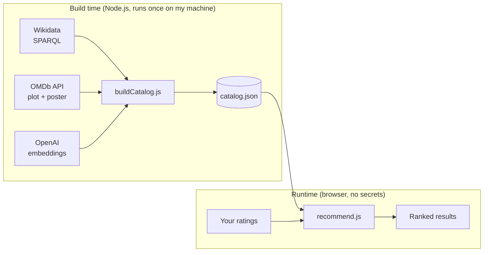

# CoCinema

**Rate a handful of movies you've seen. CoCinema finds films whose stories match your taste.**

🎬 **Live:** [cocinema-pi.vercel.app](https://cocinema-pi.vercel.app)


---

## Features

- **Quick or Full:** a landing page asks how many films you want to rate (nothing is pre-selected). Quick covers 10 of the 15 genres (a different 10 each session), Full covers all 15. Either way you can skip a film you have not seen and get a ranked list. The top 5 come with a one-line reason ("Because you rated ..."), and the rest follow in a compact grid.
- **Where a film sits for you:** the top 5 show their rank ("#3 of 561 films"), and the rest of the list and every film page show "Top N% for your taste", the film's place among all unrated films. It ranks films against each other and is not the chance you will like one.
- **Fresh every visit:** each genre has a pool of up to 8 well-known films, and the order of genres and films is shuffled per session from a saved seed, so a refresh resumes on exactly the same film.
- **Rate 5 more:** five well-known films you have not rated or skipped, at most two per genre, to sharpen the list.
- **Film pages:** tap any result for its poster, genres, runtime, director, age rating, Rotten Tomatoes score, full plot, a breakdown of how each film you rated pushed this one up or down, a YouTube trailer search, which services include it or rent or sell it in Canada, the US and the UK (from a dated Watchmode snapshot), and JustWatch search links for each (search links, not a guarantee of availability).
- **Keeps your place:** ratings and position are saved in the browser, so a refresh resumes where you were.
- **Works offline and installs to the home screen** after one visit, and is checked with an automated accessibility scan.

## How it works

CoCinema is a **content-based recommender**. Every movie's plot is turned into an embedding (a list of numbers where similar stories get similar numbers). Your ratings are combined into a single "taste profile", and every movie is ranked by how closely it points in the same direction.

**AI is used in exactly one place, offline.** Each plot is embedded once, at build time. Every live recommendation is deterministic maths running in your browser: no AI calls, no backend, no API keys in the client.



### The recommendation maths

1. **Mean-centre your ratings.** Each rating becomes a weight: how far it sits above or below *your own* average. A 7 from a harsh rater counts as a like; a 7 from someone who rates everything 9 counts as a dislike.
2. **Build a taste profile.** Multiply each rated movie's embedding by its weight and add them up. Movies you loved pull the profile toward them; movies you disliked push it away.
3. **Rank by cosine similarity.** Compare the profile to every unrated movie. Cosine similarity measures the *angle* between two vectors, so it captures what a story is about regardless of plot length.

### The data pipeline

- **Discovery:** the most popular films per genre from Wikidata, ranked by how many Wikipedia language editions cover them (sitelinks). A subquery sorts and limits *before* fetching labels, so each genre query stays fast.
- **Enrichment:** plot and poster from OMDb. A title-match guard rejects wrong matches (e.g. a "Making of…" featurette returned instead of the film).
- **Embeddings:** OpenAI `text-embedding-3-small`, reduced to 512 dimensions and rounded to 4 decimals. That's about 5 KB per movie instead of 30 KB, with no visible change in rankings.
- **Resilience:** the build is resumable. It reuses already-enriched movies, saves progress every 25, and stops cleanly at OMDb's daily limit so the next run picks up where it left off.

Current catalog: **574 movies** across 20 genres.

### Catalog schema

Each entry in `data/catalog.json`:

| Field | Type | Source |
| --- | --- | --- |
| `id` | string (Wikidata entity URL) | Wikidata |
| `title` | string | OMDb |
| `plot` | string | OMDb |
| `poster` | string or null | OMDb |
| `embedding` | number[512] | OpenAI |
| `rottenTomatoes` | string (e.g. `"87%"`) or null | OMDb |
| `runtime` | string (e.g. `"142 min"`) or null | OMDb |
| `director` | string or null | OMDb |
| `rated` | string (e.g. `"R"`) or null | OMDb |
| `genres` | string[] (from the 20 tracked genres) | Wikidata |
| `sitelinks` | number (Wikipedia language editions) | Wikidata |
| `year` | number (earliest release year) | Wikidata |

`rottenTomatoes`, `runtime`, `director` and `rated` are added by `node scripts/backfill.js`, which is resumable and skips entries it has already filled. `genres`, `sitelinks` and `year` are added by `scripts/fetchMeta.js` and `scripts/mergeMeta.js`.

### Data verification

Every catalog entry is checked against OMDb by title and year. A record is accepted only if the normalized title matches and OMDb's year is within one year of the Wikidata year (`data/overrides.json` lists the few exceptions). The plot stored in the catalog is then compared with OMDb's plot by shared-word overlap. Similar plots are verified; clearly different plots mean the entry holds another film's content, and `scripts/repairCatalog.js` replaces its plot, poster, metadata and embedding. Progress is kept in `data/verify-progress.json`. No IMDb ids are stored.

---

## Evaluation

Run on 8 October 2026 with `npm run evaluate` (fixed seed, no network). Mean over 20 genres and 1,000 synthetic users: precision@10 of 0.60 against a 0.16 baseline (a lift of 4.6x), the held-out liked film at the 73rd percentile on average, and found in the top 20 for 14% of users.

Method: for each genre with at least 25 films, a synthetic user is generated 50 times. They rate 6 films of that genre 9 or 10, 4 films outside it 2 or 3, and 2 other films 5 or 6, all picked at random with a fixed seed. One more film of the genre is held back. The real `recommend()` function ranks every unrated film, and the script records how much of the top 10 is in the genre, how that compares with the genre's share of the whole catalog, and where the held-back film lands.

Limitation: these are synthetic users whose taste is defined by Wikidata genre labels, and a film can carry several labels. The numbers show that the recommender picks up a genre signal from ratings. They say nothing about accuracy for real people, and results vary a lot by genre (from about 1.5x for drama to about 11x for westerns).

### How many ratings are enough?

`node scripts/evaluate.js --compare` runs the same simulated users with 6, 8, 10, 12 and 15 ratings in total (about half liked, a third disliked, the rest neutral). Each simulated user is drawn once at the largest size and the smaller totals use the first films of it, so the rows are directly comparable.

| Ratings | Precision@10 | Lift over chance | Hidden liked film (mean percentile) | Hidden film in top 20 |
| --- | --- | --- | --- | --- |
| 6 | 0.514 | 3.9x | 67.8 | 14.2% |
| 8 | 0.552 | 4.2x | 70.2 | 14.7% |
| 10 | 0.570 | 4.4x | 71.4 | 16.1% |
| 12 | 0.599 | 4.6x | 73.7 | 16.6% |
| 15 | 0.617 | 4.8x | 75.4 | 18.6% |

Picks get steadily better as ratings are added, with no sharp jump anywhere, and 6 ratings already do clearly better than chance. This is the same synthetic setup as above (simulated genre tastes built from Wikidata genre labels), so it describes how recommendations improve with more ratings, not how accurate they are for real people. The 12-rating row uses these nested simulated users, so it differs slightly from the standard run's 4.58x. The headline lift quoted on the landing page comes from the standard run, which writes `src/evaluation-stats.js` so the page and this section cannot disagree.

## Tech stack

- **Frontend:** plain JavaScript (ES modules), HTML, CSS. No framework, no build step.
- **Build scripts:** Node.js
- **Data:** Wikidata (CC0), OMDb API, OpenAI Embeddings API
- **Hosting:** Vercel (static)

## Project structure

```
scripts/            build time: runs locally, uses API keys
  wikidata.js       discover popular movies per genre (SPARQL)
  omdb.js           fetch plot + poster
  embeddings.js     plot → 512-number embedding
  buildCatalog.js   orchestrates everything → data/catalog.json
  buildOnboarding.js  regenerates the onboarding pools from the verified catalog
data/
  catalog.json      the only bridge between build time and runtime
  onboarding.json   hand-picked movies shown on the rating screen
src/                runtime: static files served to the browser
  main.js           screens, hash routing and the rating flows
  recommend.js      taste profile, ranking and the per-film explanation
  similarity.js     dot product, magnitude, cosine similarity
  ratings.js        the only file that touches localStorage (ratings, skips, position, seed)
  shuffle.js        seeded Fisher-Yates shuffle and the per-session onboarding order
  candidates.js     picks films for "Rate 5 more"
  why.js            builds the "Because you rated ..." sentence
  percentile.js     "Top N%" among all unrated films
  format.js         titles with years, genre ordering
  links.js          trailer and where-to-watch search URLs
  route.js          hash route helpers
  detail.js         the film page
  availability.js   loads the streaming snapshot, checks its age, builds the country text
  sw.js             service worker: offline support
  progress.js       which genre and film the visitor is on, counted in genres
  evaluation-stats.js  headline numbers written by scripts/evaluate.js (read by the landing page)
  landing-posters.js   the films in the landing poster strip (written by scripts/buildLandingPosters.js)
  fonts/            self-hosted Instrument Serif and Manrope, with their licences
  offline.js        registers the worker, shows the offline notice
  ui.js             builds DOM elements (text only, never HTML from data)
tests/              node:test unit tests (npm test)
e2e/                headless browser check at 375px (npm run test:e2e)
```

### Onboarding pools

`data/onboarding.json` holds 15 genre pools of up to 8 films. The 46 original hand-picked films are marked `handPicked` and always stay. `node scripts/buildOnboarding.js` tops each pool up with the best-known catalog films (most Wikipedia language editions) that are verified, have a poster, plot, year and embedding, and have a title that appears only once in the catalog. A film joins the pool of its rarest onboarding genre in the catalog, so it is not always counted as drama, and no film is in two pools. Pools are short until catalog verification finishes, so **rerun the script after `node scripts/verifyCatalog.js` has checked every entry**.

### Streaming availability

`node scripts/watchmode.js` looks up where each film can be watched in Canada, the United States and the United Kingdom and writes service names (subscription, and rent or buy) to `data/availability.json`. It uses 2 credits per film (one search, one sources call for all three countries), is resumable, and stops at a credit cap (`--max-credits`, default 2000) or when Watchmode reports a limit. Films are matched by name and Wikidata year, and no IMDb or other external ids are used or stored. Films with no match are stored as empty.

The film page loads this file only when a film is opened. If the file is missing, fails to load, has no entry for the film, or is more than 30 days old, the page shows only the JustWatch search links (with a short note when the data is out of date).

This is a snapshot, not live data. Under Watchmode's free plan the cached data must be **refreshed or deleted within 30 days** of the fetch date. The current snapshot was fetched on **7 October 2026**, so refresh or delete it by **6 November 2026**. The date is recorded in `fetchedAt` at the top of the file and shown on each film page as "Streaming data by Watchmode, as of ...".

To refresh: delete `data/availability.json` and run `node scripts/watchmode.js` (it skips films already stored, so deleting the file is what makes it fetch everything again). The key goes in `.env` as `WATCHMODE_API_KEY` and is never printed or committed.

Streaming data by [Watchmode](https://www.watchmode.com).

### Fonts

The two typefaces are self-hosted in `src/fonts/` (Latin subset, `font-display: swap`, the two main ones preloaded and saved by the service worker so the page looks right offline). Nothing is requested from Google.

| File | Typeface | Licence |
| --- | --- | --- |
| `instrument-serif-regular-latin.woff2`, `instrument-serif-italic-latin.woff2` | Instrument Serif (headline, big numbers) | SIL Open Font License 1.1, see `src/fonts/OFL-instrument-serif.txt` |
| `manrope-variable-latin.woff2` | Manrope, one variable file covering weights 400 to 800 (everything else) | SIL Open Font License 1.1, see `src/fonts/OFL-manrope.txt` |

### Offline use

After one successful visit the app opens and works with no connection: the landing screen, onboarding, results, film pages, the catalog and the saved streaming snapshot. A service worker (`src/sw.js`) keeps one cache with a version name (`cocinema-v1`); bumping that name on a deploy makes every phone drop the old cache and fetch everything fresh.

- **Code (HTML, JS, CSS) is network-first.** With signal you always get the latest deploy, with a 4 second wait before falling back to the saved copy. The cost is a small delay on a slow connection.
- **Data files (`catalog.json`, `onboarding.json`, `availability.json`) are stale-while-revalidate.** They open instantly from the cache and refresh in the background. The cost is that a visitor can see data one visit behind, which is fine for a catalog that changes rarely.
- **Other sites are never cached.** Posters and the font come from other origins and are left alone, so offline the cards show placeholders.

The worker is registered only on https or 127.0.0.1, inside a try/catch, so the app works the same without it. `vercel.json` serves `sw.js` uncached and allows it to control the whole site (the app lives under `/src/` and `/` redirects there). A small "Offline - using saved data" notice appears while the browser is offline.

### Known limits

- Posters are linked from another site and need a connection; offline you see placeholder cards.
- Posters are linked from another site, which can see a visitor's IP address like any site would. Fonts are self-hosted, so no request leaves the app for fonts. The app has no account, and ratings and the taste profile stay on the device.
- Streaming availability is a dated snapshot that must be refreshed or deleted within 30 days, and the JustWatch links are searches, not guarantees.
- The evaluation uses synthetic genre-based personas and says nothing about accuracy for real people.
- Not every catalog entry has been checked against its year yet (the verify script is part way through), so a few entries can still hold another film's plot or details. "Deep Impact" is a known example.

### Routing

There is one HTML page. The film page is a fourth screen shown at `#/movie/<Wikidata id>` (for example `#/movie/Q104123`). `main.js` listens for `hashchange` and also routes once on load, after the saved ratings have been restored, so a film URL works after a refresh and Back returns to the results at the same scroll position. An unknown id shows a "Movie not found" screen with a way back.

## Running locally

```bash
npm install

# Only needed to rebuild the catalog. The site itself needs no keys.
# Create a .env file in the project root:
#   OMDB_API_KEY=your_key
#   OPENAI_API_KEY=your_key
node scripts/buildCatalog.js

# Run the unit tests and the synthetic evaluation
npm test
npm run evaluate
npm run test:e2e   # headless Chrome at 375px: app, offline mode and an accessibility scan; saves screenshots to screenshots/
npm run build:assets   # redraws the icons and link-preview image
npm run build:landing  # re-picks the landing poster strip from the verified catalog

# Serve the site
npx serve . -l tcp://127.0.0.1:3000
# then open http://127.0.0.1:3000/src/
```

## Roadmap

- Streaming service names on film pages, from a data file
- Shuffled onboarding from a larger pool, so repeat visits feel fresh
- Co-watch mode: two people rate, and CoCinema finds films you'd both enjoy

## Credits

Movie data from [Wikidata](https://www.wikidata.org) (CC0) and the [OMDb API](https://www.omdbapi.com). Embeddings by [OpenAI](https://platform.openai.com).
